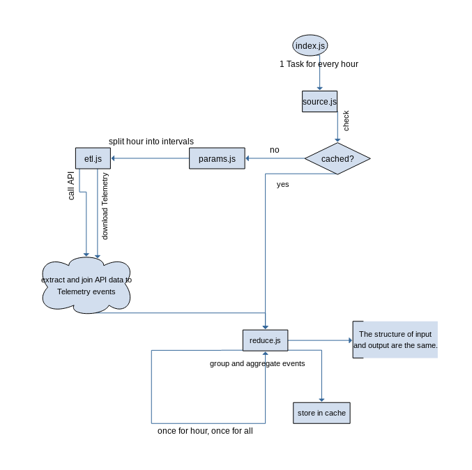

# brokentalents.fun

## Setup

 * `npm install`
 * create backend/secret.js as `module.exports.apikey = 'yourapikey';` or export the env var `API_KEY=""`

## Updating the data

`npm run backend`

`parallel -eta convert {} {.}.jpg ::: dist/assets/*/*/*.png`

## Building the frontend

 * production: `npm run build`
 * development: `npm run dev`

## Overview

### Frontend

The frontend is written with the [Vue](https://vuejs.org) JavaScript framework and the [Bulma](https://bulma.io) CSS framework using [Buefy](https://buefy.github.io), built by [Webpack](https://webpack.js.org) with [Babel](https://babeljs.io) for cross browser support. It is hosted on GitHub pages.

### Backend

The `/matches` endpoint is called in equidistant intervals for a small set of matches. An hour of each set is aggregated and stored in a timestamped json. All timestamped jsons are aggregated and generate the output report json.

The code was written with [Ramda](https://ramdajs.com) as an excercise in functional programming with JavaScript.
